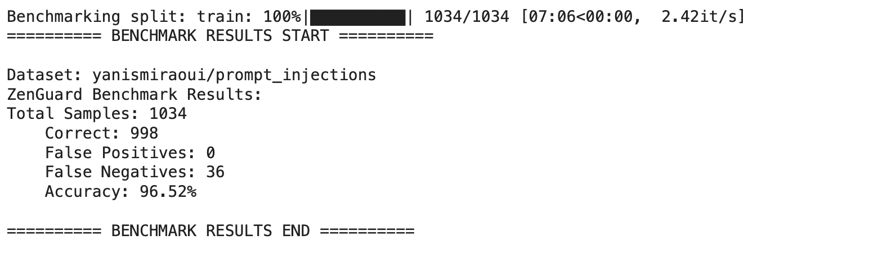

   

# ZenGuard AI Benchmarks

This repository contains benchmarks for [ZenGuard AI](https://zenguard.ai) and information on how to run them.

There are two types of benchmarks that we run against ZenGuard AI:

1. Hugging Face datasets based benchmarks
2. ZenGuard AI Generated Benchmark - Zen Bench

Here you can find both benchmark results and how to run them yourself.

## Public Datasets benchmarks

We are constantly monitoring Hugging Face for new datasets that relate to GenAI security. Then we run them against ZenGuard AI to find any potential security issues with our product.

### ZenGuard AI Accuracy against Hugging Face datasets

| # | Dataset | Accuracy | Date Added |
|---|---------|----------|------------|
| 1 | [xTRam1/safe-guard-prompt-injection](https://huggingface.co/datasets/xTRam1/safe-guard-prompt-injection) | 96% | 2024-07-01 |
| 2 | [yanismiraoui/prompt_injections](https://huggingface.co/datasets/yanismiraoui/prompt_injections) | 96.5% | 2024-08-01 |
| 3 | [Harelix/Prompt-Injection-Mixed-Techniques-2024](https://huggingface.co/datasets/Harelix/Prompt-Injection-Mixed-Techniques-2024) | 92% | 2024-10-01 |
| 4 | [aporia-ai/prompt_injection](https://huggingface.co/datasets/aporia-ai/prompt_injection) | 87.68% | 2024-05-15 |
| 5 | [deepset/prompt-injections](https://huggingface.co/datasets/deepset/prompt-injections) | 87% | 2024-05-15 |
| 6 | [JasperLS/prompt-injections](https://huggingface.co/datasets/JasperLS/prompt-injections) | 87% | 2024-05-15 |

### Check for yourself. Or run your own dataset.

We have developed the [ZenGuard Benchmarks PyPi package](https://pypi.org/project/zenguard-benchmarks/) to help test and benchmark ZenGuard AI better.

Here are the instructions on how to use the package. 

### Benchmarking Output

Here is an example of what the benchmarking output looks like:

Where:

* `Total Samples`: The total number of prompts processed.
* `Correct`: The number of prompts that were classified correctly.
* `False Positives`: The number of prompts incorrectly identified as attacks.
* `False Negatives`: The number of actual prompt attacks that went undetected.
* `Accuracy`: The ratio of correctly classified prompts to the total number of samples.

## Zen Bench

Our own benchmark is incoming.

## More information

A much more detailed documentation is available at [docs.zenguard.ai](https://docs.zenguard.ai/).

Test the capabilities of ZenGuard AI in our ZenGuard [Playground](https://console.zenguard.ai/chat). It's available to start for free to understand how our guardrails can enhance your GenAI applications.

Check out our [Client](https://github.com/ZenGuard-AI/fast-llm-security-guardrails) library to get started with integrating ZenGuard AI into your project.

## Support

[Book a Demo](https://calendly.com/galym-u) or just shoot us an email to hello@zenguard.ai

Topics we care about - LLM Security, LLM Guardrails, Prompt Injections, GenAI Security.

---

Developed with ❤️ by <a href="https://zenguard.ai/">ZenGuard AI</a>

